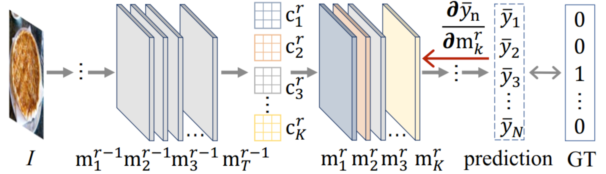

## Model Doctor: A Simple Gradient Aggregation Strategy for Diagnosing and Treating CNN Classifiers



This is an official PyTorch implementation of the [Model Doctor](https://arxiv.org/pdf/2112.04934.pdf):
```
@article{feng2021model,
  title={Model Doctor: A Simple Gradient Aggregation Strategy for Diagnosing and Treating CNN Classifiers},
  author={Feng, Zunlei and Hu, Jiacong and Wu, Sai and Yu, Xiaotian and Song, Jie and Song, Mingli},
  journal={AAAI},
  year={2021}
}
```
### Environment
+ python 3.8

### Repository structure
```
.
├── core                   // the core code of the paper
├── loaders                // the data loaders of the CIFAR-10, CIFAR-100, etc
├── metrics                // the metrics method of the model, such as accuracy
├── models                 // various CNN models include AlexNet, VGGNet, etc
├── preprocessing          // preprocessing the different datasets and labelme annotations
├── scripts                // the script command to run the code
├── utils                  // various tools include file tool, train tool
├── test.py                // test a classification model
├── train.py               // train a pure classification model
└── train_model_doctor.py  // train a classification model with the model doctor
```

### Command
#### 1. Train a pre-trained model
```shell
 bash scripts/train.sh
```
#### 2. Prepare for channel constraints
1. Sift high confidence images
 ```shell
 bash scripts/image_sift.sh
 ```
2. Calculate the gradient for each class
 ```shell
 bash scripts/grad_calcualte.sh
 ```

#### 3. Prepare for spatial constraints
1. Sift low confidence images
 ```shell
 bash scripts/image_sift.sh
 ```
2. Label the foreground area with [labelme](https://github.com/wkentaro/labelme)
3. Convert labelme annotation files into masks
```
python preprocessing/labelme_to_mask.py
```

#### 4. Train the model with the model doctor:
```shell
bash scripts/train_model_doctor.sh
```

### Tips
As we described in the paper, the small size dataset (such as MNIST, Fashion-MNIST, CIFAR-10, CIFAR-100) is not suitable for spatial constraint, so if you want to use a small size dataset or channel constraint only, please set `beta = 0` in `scripts/train_model_doctor.sh`. 


